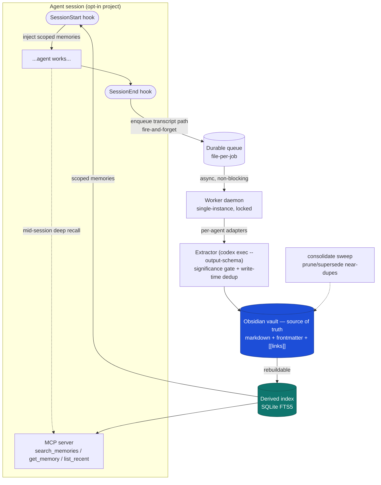

# wren

Async memory for AI coding agents. wren hooks into **Claude Code** and
**Codex**, extracts durable knowledge from finished sessions with a background
LLM, stores it as an Obsidian-friendly markdown vault, and feeds the relevant
subset back into future sessions — so agents stop re-deriving the same fixes and
re-forgetting your preferences.

## Why

Coding agents start every session from zero: same mistakes, re-derived solutions,
forgotten preferences. wren gives them a persistent, growing memory without
getting in the way:

- **Non-blocking capture.** The session-end hook does no LLM work — it enqueues
  the transcript, optionally nudges a detached one-shot worker, and returns.
  Extraction happens out of band in a background worker, so the agent is never
  slowed down.
- **You own the data.** Memories are plain markdown in a vault you can read, edit,
  grep, and put under git. The search index is derived and disposable.
- **Two-way recall.** Relevant memories are injected at session start (cheap,
  always-on for Claude Code) and are also searchable on demand mid-session via
  an MCP tool.

## Architecture



- **Source of truth** is the markdown vault (human-browsable, git-able).
- The **SQLite FTS5 index** is derived and fully rebuildable (`rebuild`).
- The **extractor LLM is always `codex exec`** regardless of which agent produced
  the transcript; per-agent **adapters** normalize transcripts to a common shape
  first.

## Requirements

- [Codex CLI](https://github.com/openai/codex) — used as the extraction LLM
- [Bun](https://bun.sh) ≥ 1.3 — **only to build the binary**; the compiled binary
  embeds the Bun runtime, so it needs nothing at runtime.
- Claude Code is the first-class capture target; Codex capture is experimental.

## Install

Build a standalone `wren` binary and drop it on your `PATH`
(`~/.local/bin`, no sudo):

```bash
bun install
scripts/install.sh            # builds dist/wren → ~/.local/bin/wren

wren --help
```

Then do the one-time, agent-agnostic setup (config + vault dirs, MCP
registration, systemd user unit) and start the worker:

```bash
wren install           # add --codex to also wire Codex MCP + SessionStart, --systemd to start the daemon now

# Start the worker daemon (drains the queue, runs the extractor)
systemctl --user enable --now wren.service
# ...or run it in the foreground:
wren worker
```

The wiring wren writes into agent configs (hooks, MCP, the systemd unit)
points at the installed binary, so it keeps working even if you delete this repo.

> Even without the systemd daemon, the capture hook nudges a one-shot worker
> after enqueuing (guarded by a lock so only one runs). Set
> `WREN_NO_AUTODRAIN=1` to disable that fallback.

> **Other machines / arches:** `bun run build:linux-x64` or
> `bun run build:linux-arm64` produce a self-contained binary you can copy to a
> machine without Bun installed.

> **From source (dev):** you can skip the build and run any command with
> `bun run src/cli.ts <command>`; wiring written in this mode points back at the
> source tree (handy while iterating).

## Opt a project in

Capture is **opt-in per project**. Enabling writes both a central registry
(`~/.config/wren/projects.toml`, the source of truth) and the agent's
native per-project config:

```bash
wren enable /path/to/project            # Claude hooks + registry
wren enable /path/to/project --codex    # also wire Codex (Stop/SessionStart hooks → <project>/.codex/hooks.json; trust → ~/.codex/config.toml)
wren disable /path/to/project
```

New sessions in that project are then captured automatically. Hook scripts
re-check the registry and no-op if the project isn't enabled, so a stale hook
never captures a project you've turned off.

> **Native memory is turned off** so the vault stays the single source of truth
> and you don't run two diverging stores. `wren enable` sets
> `autoMemoryEnabled: false` in the project's Claude settings (per-project);
> `wren install --codex` sets `[features] memories = false` in the Codex home —
> home-wide, since Codex memory lives in `CODEX_HOME/memories/`, not per-project,
> so it covers every project under that home. It also writes a Codex
> `SessionStart` hook into `CODEX_HOME/hooks.json` that reminds Codex to load
> Wren memories from the MCP server. `wren enable --codex` writes the same
> `SessionStart` reminder into the project-local `.codex/hooks.json` alongside
> Wren's capture hook.

## Commands

| Command | What it does |
| --- | --- |
| `install [--codex] [--systemd]` | Config, MCP registration, worker unit |
| `enable <path> [--codex]` | Opt a project in (registry + agent hooks) |
| `disable <path>` | Opt a project out |
| `worker [--once] [--interval N]` | Drain the queue (daemon by default) |
| `mcp` | Run the stdio MCP server |
| `rebuild` | Rebuild the search index from the vault |
| `consolidate [--dry-run]` | Prune/supersede near-duplicate learnings |
| `codex-home` | Detect codex homes on the machine; pick which one wren extracts transcripts from |
| `status` | Show config, projects, queue, index |
| `extract <file> [--agent A] [--cwd P] [--scope S]` | Manually extract one transcript (testing/backfill) |

## Configuration

`~/.config/wren/config.toml`:

```toml
vault_path = "/home/you/.local/share/wren/vault"
# extractor_model = "gpt-5-codex-mini"   # optional -m for codex exec; omit for default
# codex_bin = "codex"
# codex_home = "~/.codex"                 # which codex home to read transcripts from;
                                          # run `wren codex-home` to detect + pick one
max_inject = 15                          # cap on memories injected at SessionStart
# settle_ms = 180000                    # Codex transcript quiet period
# codex_recapture_ms = 3600000          # minimum delay between session revisions
```

> A machine can have more than one codex home (a relocated `$CODEX_HOME`, a
> leftover `~/.codex-old`, ...). `wren codex-home` lists the ones it finds with
> session counts and persists your choice as `codex_home`. Defaults to
> `$CODEX_HOME` or `~/.codex`.

Environment overrides: `WREN_CONFIG_DIR`, `WREN_DATA_DIR`,
`WREN_FAKE_EXTRACTOR` (offline heuristic extractor, no LLM — useful for
trying the pipeline without spending tokens), `WREN_LOG_LEVEL`,
`WREN_CODEX_ARGS`, `WREN_NO_AUTODRAIN`, `WREN_CODEX_BIN` and
`WREN_EXTRACTOR_MODEL` (override the `codex_bin` / `extractor_model` config
keys), `WREN_SETTLE_MS` (Codex idle-settle window, ms, before extraction), and
`WREN_CODEX_RECAPTURE_MS` (minimum delay between revisions of one Codex session).

## Memory note format

Atomic markdown notes with YAML frontmatter and `[[wikilinks]]`:

```markdown
---
id: 01KTSP5QVQVJM4RR3EJRGE9749
type: preference            # learning | preference | decision | failure | session
scope: /home/you/projects/foo   # project path, or "global"
agent: claude-code
created: 2026-06-10T21:14:21.937Z
source_session: <session id>
title: Use bun for project commands
tags: [bun, package-manager]
---

The user prefers bun for this project and said to never use npm.

**Why:** Package manager consistency matches the user's workflow.
**How to apply:** Use bun install / bun run; avoid npm here.

Related: [[session-2026-06-10-...]]
```

Vault layout: `projects/<slug>/{learnings,sessions}/` per project, plus a shared
`global/` scope for cross-project facts (user preferences, tooling quirks).

## Safety

- **Secrets are scrubbed twice** (deterministic regex pass) — over the transcript
  before it reaches the extractor, and over every note before it's written. The
  extractor prompt also forbids emitting credentials.
- Claude transcripts are copied into a mode-`0600` queue spool before SessionEnd
  returns, then removed after successful processing. Failed jobs retain their
  spool copy for diagnosis and recovery.
- The worker is **single-instance** (lock file) and writes are **atomic**, so
  concurrent session ends can't corrupt the vault or index.
- Jobs are **idempotent** (keyed on session id + transcript hash) and **retried**
  before landing in `queue/failed/`.

## Development

```bash
bun test            # unit + MCP integration tests
bun run typecheck   # tsc --noEmit
bun run lint        # biome check
bun run format      # biome check --write
```

## Status & roadmap

The full pipeline — capture → extract → store → retrieve — works end to end,
verified on real transcripts including a live `codex exec` extraction and the MCP
server over stdio.

- ✅ Claude Code capture, injection, and MCP search
- ✅ Background worker, durable queue, secret scrubbing, consolidation sweep
- 🧪 Codex capture (transcript adapter + rollout discovery + config writer) —
  experimental; the Codex hook payload still needs hardening
- 🔜 Semantic search via local embeddings (keyword FTS5 is the default for now)
- 🔜 More agents via additional adapters
